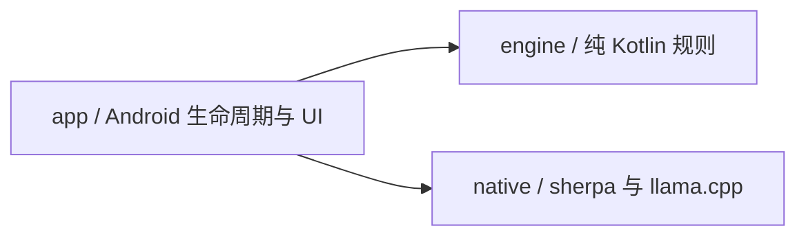
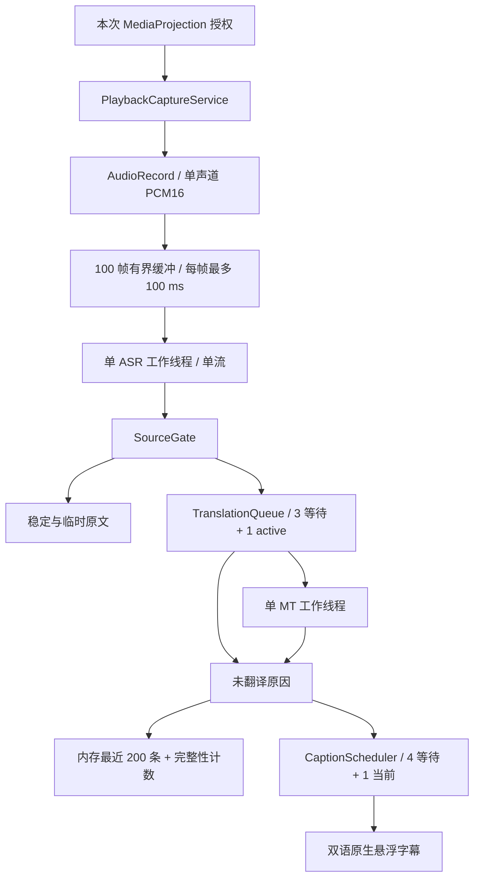

# 架构与开发边界

## 1. 三种不同的时间尺度

识别假设可以修订，翻译需要完整语义，阅读需要稳定停留。`SourceGate` 分开管理原文稳定与语义提交，`TranslationQueue` 管理串行推理，`CaptionScheduler` 管理阅读。翻译 token 不直接驱动字幕。

推理积压与阅读积压分别计数。前者给出明确未翻译结果；后者保留完整记录并提示回看，不摘要、不删除已确认文本。

## 2. 三个模块

| 模块 | M1 实现 |
| --- | --- |
| `app` | Compose 三页、权限与前台服务、会话 owner、PCM 缓冲、原生 View 悬浮窗、离线语言包导入 |
| `engine` | 原文稳定/提交/修订、单工作器队列、分页阅读调度、确定性回归检查 |
| `native` | 固定版本 sherpa Kotlin/JNI、llama.cpp CPU C++ 绑定、句柄与取消 token |

`engine` 不依赖 Android、JNI、网络和推理库。测试注入时间，无需睡眠或模型。应用没有本地 HTTP 服务、Python 运行时、DI 或多后端注册框架。M0 固定文本预览已移除。

## 3. 数据流与所有权

### 3.1 生命周期与取消

用户开启后重新取得系统授权；服务立即进入 `mediaProjection` 前台状态，再消费这一次 consent。语言包校验和加载在后台线程完成，然后开始 AudioRecord。`START_NOT_STICKY` 禁止系统恢复旧授权。不开 VirtualDisplay、Surface 或图像读取器。Android 14+ 以 `MediaProjectionConfig.createConfigForDefaultDisplay()` 请求授权，系统界面只提供共享整个屏幕。[Android 播放捕获](https://developer.android.com/media/platform/av-capture)、[MediaProjection](https://developer.android.com/media/grow/media-projection)

`CaptionSession` 的可变状态全部由 Main owner 修改。PCM 通过有界 Channel 进入；ASR 与 MT 各自只有一个专用线程。native 构造、调用、析构均在其所属线程上执行。UI 不持有 native 句柄。

停止顺序：关闭输入、停止 AudioRecord 以解除阻塞、给所有未完成确认片段发出 `STOPPED`、置 native 原子取消标记、停止发布阅读页、处理已接受的 ASR 尾部、等待工作器返回、释放模型/线程/悬浮窗/projection、结束前台服务。回收完成前仍保持 busy，禁止开始第二个会话。系统撤销授权使用同一路径。读协程负责唯一一次 AudioRecord release。服务与会话以 `CaptureStatus` 发布准备、等待声音、聆听、未收到声音与各停止原因；界面将其映射为符号与短标签，不解析异常文本。

Kotlin Job 取消不等于 JNI 取消。MT token 在派发前创建，含原子取消标志与 steady-clock deadline；CPU abort callback 在计算边界协作返回。调用返回并卸下 callback 后才释放 token。超时/撤回后，队列保留 active 槽直到匹配的 completion 到达，因此不会启动孤儿翻译或并行访问 context。ASR 库没有中途终止构造/解码 API，停止需要等待正在执行的调用返回。

### 3.2 音频与时间

优先请求 16 kHz、单声道、PCM16；失败后请求 48 kHz。每次读取最多 100 ms，缓冲最多 100 帧，即至多 10 秒。缓冲满时显式结束会话并说明识别跟不上，绝不 `DROP_OLDEST`。不通过 VAD 剔除低音量片段；幅度阈值只用于“未收到声音”的提示，不推断 DRM。

sherpa 内部有状态 `LinearResample` 将 48 kHz 输入转换到 16 kHz 特征率。会话内不切换输入率。真实采集按读取帧数计算样本时间；队列等待用 `SystemClock.elapsedRealtime()`。测试回放按样本数与同一单调时钟以 1× 速度供给。片段 `endMs` 是语义确认时已处理的样本位置，并非人工标注的发音结束位置，更不是源视频时间轴。当前不做硬件时钟漂移校准，长时漂移验收属于 M2。

实际 EOF/停止时才追加 960 ms 零样本并 `inputFinished()`，用于冲刷模型尾部；正常采集不注入静音。声学 endpoint 后提取最终残段，再使用 sherpa 的 stream reset 保留编码器和解码上下文。下游语义提交从不 reset ASR。

### 3.3 身份、语义与修订

每个会话有 UUID，`SegmentKey(sessionId, sequence, revision)` 完整匹配才接受结果。sequence 始终递增；修正后的整体重译使用新 sequence 和 revision=1，不复用旧任务身份。

每个 utterance 一个 SourceGate，只接受更高的新音频 revision。两次假设的共同前缀为稳定原文；英文半词不会被当成稳定前缀。标点分句保守处理常见缩写、小数和姓名首字母；最长等待 5.5 秒，对明显未闭合的英文尾部额外等待最多 1.5 秒。声学 endpoint 确认最终残段。规则是可测试的启发式，不能保证语义总是正确。

只补上的句号等纯标点尾部不构成新的翻译任务；它仍被 gate 消费，避免重复提交。native 接口也拒绝没有文字或数字的片段，防止把历史上下文误当成待翻译内容。

当已提交前缀被 ASR 推翻时，立即撤回本 utterance 对应的显示/待译内容，取消其 active MT，将历史标记为 `SUPERSEDED`，清除失效上下文。在声学 endpoint 只提交一次完整修正，避免连续修订反复重译。原文超过 8,192 字符会明确报错停止，不能静默截断。

### 3.4 队列、上下文与完整性

MT 默认 3 个等待槽和 1 个 active，确认后最多等待 8 秒。上下文最多 4 个已确认原文片段、512 字符；native tokenizer 再限制历史最多 256 tokens，总输入加输出不超过 2,048 tokens。整段译文最多 256 输出 tokens，未遇 EOG 就用尽预算属于失败，不显示截断译文。

同一个 MT 协程在完成后直接处理下一条未过期任务，不再等待 80 ms 的显示轮询。译文完成时立即交给阅读调度；已有页面仍遵守最短停留。native 在成功或异常返回前统一清零 KV，不在下一次入口重复清零；没有跨请求缓存复用。

终态为译文或 `BACKLOG / FAILED / TIMED_OUT / STOPPED / SUPERSEDED`。溢出、超时、停止返回值均被消费，确认计数与终态计数可核对。BACKLOG 立即进记录并更新单独提示，不把较晚的拒绝片段插到较早的在途译文之前。内存记录按 sequence 排序，只保留最近 200 条；计数覆盖整个会话。持久记录属于 M2。

### 3.5 阅读与悬浮窗

Android `StaticLayout` 按实际字号测量每种语言最多两行的页面，阅读调度每页停留 1.6–6 秒。中英阅读时间分别估算：汉字每码点 100 ms，其他码点 50 ms；取原文和译文较长的一侧，不把两侧时间相加。这是待阅读测试校准的启发式，不代表每位用户都能以此速度读完。完整文本保留在记录，长译文分多页，不用省略号代替后半句。队列满或迟到结果更新阅读积压提示；显示序号不会倒退。字体/显示配置改变后重新测量待显示内容。

悬浮层有两个原生 Window：正文卡片默认 `FLAG_NOT_TOUCHABLE`，其上方居中的 48 dp 把手支持拖动（靠近水平中心时吸附）与轻点切换。穿透时正文窗口 alpha 不超过系统允许的触摸遮挡阈值；Android 12+ 仅设背景透明度不足以允许穿透。拦截模式下卡片可触摸、不透明并以绿色描边标识，轻点卡片或把手回到穿透。尚无文字时卡片收缩为图标加短词的状态胶囊；未稳定的临时原文以较暗颜色显示，译文位置用脉动圆点占位；长字幕的分页以卡片底部细分段条表示。[WindowManager 触摸规则](https://developer.android.com/reference/android/view/WindowManager.LayoutParams#FLAG_NOT_TOUCHABLE)

横竖屏分别保存位置，依据 WindowMetrics、系统栏与刘海安全区约束范围。两方向使用保守的窄边宽度；字体缩放按系统 sp。只使用 `SYSTEM_ALERT_WINDOW`，不用无障碍绕过权限。拒绝悬浮窗时仍能在应用内部查看字幕。

## 4. 固定模型与运行库

`models/zh-en.json` 是 M1 实验性语言包，固定 matched files、revision、大小、SHA-256 与 runtime commit。它通过指定真机的合成语音基础验证，不代表跨机型质量或长时性能已达标。

| 部分 | 固定配置 |
| --- | --- |
| ASR | X-ASR zh/en 480 ms；sherpa-onnx v1.13.8 / `11afbd0…`；ORT 1.28.2；CPU 单线程、greedy search |
| MT | Hy-MT2 1.8B Q4_K_M；llama.cpp v0.4.0 / `5266f24…`；CPU 3 线程；context 2,048、batch 256、ubatch 64 |
| Android native | NDK 27.1.12297006、CMake 3.22.1、arm64-v8a / ARMv8-A 基线；16 KB LOAD 对齐 |

sherpa 官方 Android archive 和源代码 tar 的哈希固定在 `scripts/prepare-native.sh`。直接复用同版本 Kotlin JNI 声明，不手写另一套 C API。llama.cpp 源代码固定并静态链接到自己的小型 JNI 动态库，无 GPU/QNN 和动态后端下载。

翻译使用模型文件内的 Hy-MT2 单用户模板。BOS、角色分隔符单独识别为 special tokens；源文本与历史始终 `parse_special=false`，不能注入角色控制 token。采样固定 top-k 20、top-p 0.6、temperature 0.7、repeat penalty 1.05。JNI 用 UTF-8 byte arrays 传输输入输出，不用 modified UTF-8 的 `NewStringUTF` 传中文结果。[X-ASR 模型卡](https://huggingface.co/GilgameshWind/X-ASR-zh-en)、[Hy-MT2 GGUF](https://huggingface.co/tencent/Hy-MT2-1.8B-GGUF)

### 4.1 离线安装

M1 只做 SAF 文件夹导入及开发机部署。导入只接受清单中五个文件名，复制到应用私有 staging，严格检查尺寸和 SHA-256，随后以同目录 rename 切换；失败保留旧包。校验标记绑定完整清单哈希；开始推理前重新校验权重。运行或回收期间不允许替换包。应用无 INTERNET 权限、无账号、不保存原始音频，不动态下载 `.so`。

完整下载器、断点续传、用户取消和持久任务恢复留给 M2。native/model 许可与第三方说明见 `third_party/`，公开分发前还需完整传递依赖许可审计。

## 5. 后续工作

暂停/回看、Room 与文字保留选择、TXT/SRT/VTT、相关术语、完整安装管理、30–60 分钟热稳态、多设备画像尚未实现。已知 ASR 错词与延迟目标差距必须保留在验收记录。任何日语、STQ 或加速后端均须独立验证，不能把短样本吞吐当作持续体验达标。详见 [验收计划](validation.md)。
