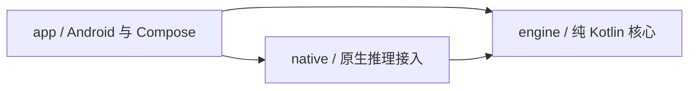
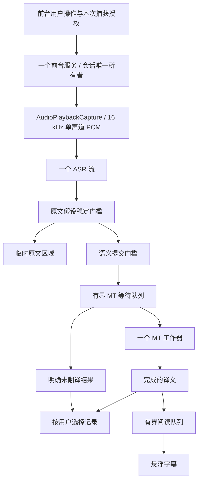

# 架构与开发边界

## 1. 为什么是字幕系统，而不是两个模型的串联

语音识别产生可修订假设，翻译需要相对完整语义，屏幕需要稳定且可读的短句。三者的时间尺度不同，因此不能由一个字符串流直接驱动所有输出。模型选择决定质量上限，提交策略和调度决定用户实际读到什么。

两种积压也必须分开：MT 还未译完属于推理积压；译文已完成但来不及阅读属于显示积压。降低前者可通过减少上下文和经过验证的轻量模型；后者应调整展示、提示回看，不能悄悄删除或摘要。

## 2. 模块及依赖

| 模块 | 当前实现 | 接入后职责 |
| --- | --- | --- |
| `app` | 三个原生页面、固定文本回放、前台音频诊断服务 | 权限、生命周期、悬浮窗、Room、DataStore、语言包安装 |
| `engine` | 原文稳定与语义门槛、有界单工作队列、阅读调度、可执行回归检查 | 会话协调、上下文与术语预算、性能与修正策略 |
| `native` | 可编译 Android library；明确 `isIntegrated=false` | 固定版本 sherpa-onnx/llama.cpp 直接集成，管理本地模型句柄 |

`engine` 不依赖 Android、网络、UI、JNI 或推理库。时间由调用方传入，测试不睡眠。没有 DI 框架、Python 运行时、Termux、本地 HTTP 服务、通用后端注册中心或空 JNI 成功实现。

目前 `native` 是编译边界，不含 C++ 或可运行推理适配器；接入真实库时才加入对应 CMake/NDK 配置和必要接口。不要仅把 `isIntegrated` 改为 true，就开放真实字幕。

## 3. 目标数据流与生命周期

M0 只有音频诊断走真实 capture 路径；回放将固定文本送进 `SourceGate → TranslationQueue → CaptionScheduler`。两者不相连，不把音频幅度或演示译文当作 ASR/MT。

会话状态目标为 `Idle → Preparing → AwaitingConsent → Running ↔ Paused → Stopping → Idle`，授权撤销/推理异常进入可解释的结束状态。回看是 UI 阅读游标，不进入 `Paused`。M0 仅实现诊断的开始/结束，以及演示的运行/停止，不制造未实现状态机。

### 3.1 会话所有权

前台服务持有 `MediaProjection`、`AudioRecord`、一个识别句柄、一个翻译句柄和所属 coroutine scope。取消顺序：禁止新输入 → 终止读音频 → 取消并等待原生调用 → 为未完成片段生成状态 → 释放句柄/缓冲/悬浮窗 → 结束前台服务。识别与翻译在工作线程执行，核心队列状态由单一 owner 顺序修改。

当前诊断使用 `START_NOT_STICKY`，不重用或持久化 projection token。收到 `MediaProjection.Callback.onStop()` 即结束采集；正常通知停止同样释放资源。AudioRecord 的读取协程负责 release，服务 stop 用于解除阻塞读取，避免读线程和销毁路径同时释放句柄。Android 10+ 播放捕获需要 `RECORD_AUDIO` 与用户授权，且源应用可以限制捕获。[Android 播放捕获文档](https://developer.android.com/media/platform/av-capture)

Android 14+ 的前台服务须声明 `mediaProjection` 类型与相应权限，并先进入前台再取得 projection。每次开始重新申请授权；无需为纯音频创建 VirtualDisplay、Surface 或图像读取器。[MediaProjection 文档](https://developer.android.com/media/grow/media-projection)

M0 的诊断不申请悬浮窗权限；M1 真正创建跨应用字幕时才添加 `SYSTEM_ALERT_WINDOW` 引导。禁止用无障碍或通知读取绕过权限限制。系统录音权限对话框的用语不改变本应用只使用播放捕获、不使用麦克风 AudioSource 的实现。

### 3.2 身份与时间

`SegmentKey(sessionId, sequence, revision)` 标识翻译任务。每次回放/真实会话新建 UUID，序号在会话内递增。返回结果只有在完全匹配当前 active key 时才可接受。M0 提交片段保持 revision=0；显式纠错重译协议属于 M1，不复用 sequence 绕过当前队列校验。

所有核心时间为相对于会话起点的单调毫秒。实际音频接入需附上采样位置，用 `AudioTimestamp`/帧计数建立时钟；当前诊断只报告信号，不提供字幕时间。禁止将 `System.currentTimeMillis()` 直接用于排队/超时判断。

### 3.3 原文与语义门槛

`SourceGate` 每个 ASR utterance 一个实例，输入该 utterance 的累积文本。只有来自新音频的更高 revision 才算一次假设；重发同一 callback 不能伪造 LocalAgreement。相同前缀可以显示，当前简化的提交条件是稳定尾部终止标点、endpoint 或最长等待。最终文本可以一次确认。

提交后的源前缀若发生修改，输出 `correctionRequired` 并停止继续提交该 utterance，避免偷偷混合两个版本。M1 必须消费这个信号：显式纠正正在显示的片段并记录修正事件；不能将当前 gate 直接接入真实 ASR 后忽略它。

当前是可测试的规则基线，不具备完整语义理解。缩写、英文否定、数字标点、日语句末语序、长中文连续句、ASR endpoint 与下游分句分离，均需语料验证。只有新假设会推进 gate；没有新音频时的最终刷新由 ASR endpoint/尾部 flush 驱动。

### 3.4 有界队列与完整性

默认 MT 等待容量 3，加一个 active；上下文最多 4 个已确认原文片段、总计 1,024 字符。字符数只限制内存，不冒充模型 token 数；M1 在 tokenizer 边界再执行独立 token 预算和相关术语预算。

`submit` 满队列直接返回 `BACKLOG`，调用方必须显示/入记录。`complete` 对空或过长结果返回 `FAILED`，超龄返回 `TIMED_OUT`。`stop` 返回所有尚未完成的片段，调用方不能忽略。演示停止保存这些结果；重新预览明确清空旧演示记录并建立新会话。

`expire` 是 owner 驱动的 watchdog 操作，负责生成可核对的超时结果。它本身不能终止 JNI：调用方必须先取消并 join 超时工作，再 take 新任务，保证单路推理。不能指望取消 Kotlin Job 自动打断 C++。

默认阅读等待容量 4，加一个当前字幕，停留 1.6–6 秒、按 Unicode code point 计数。`offer=false` 是阅读积压，调用方保留历史并显示回看提示。该规则不进行字体换行或目标语言阅读速度估计，悬浮窗行数/拆分属于 M1。禁止通过 `DROP_OLDEST` 隐藏已确认片段。

## 4. 模型接入与分发

初始基线为中英 X-ASR 480 ms 的匹配 encoder/decoder/joiner/tokens，与 Hy-MT2-1.8B Q4_K_M。X-ASR 官方明确不同 chunk 目录文件不能混用。[X-ASR 模型卡](https://huggingface.co/GilgameshWind/X-ASR-zh-en)

`models/candidates.json` 记录候选 checkpoint revision、文件尺寸、SHA-256 和许可标识；这些来自官方仓库元数据，tokens 文件另行下载计算哈希。大型权重没有下载或运行。清单的 `installable=false`，不是可发布语言包。权重存在不能证明推理内核兼容或手机实时性能。[Hy-MT2 官方 GGUF](https://huggingface.co/tencent/Hy-MT2-1.8B-GGUF)

M1 接入时固定 runtime commit、NDK/CMake 版本、ABI、线程数、模型文件和 prompt；CPU 基线通过后才试 GPU/QNN。llama.cpp 提供 Android 原生集成路径，应在此基础上直接绑定，而非带入本地服务。[llama.cpp Android 文档](https://raw.githubusercontent.com/ggml-org/llama.cpp/master/docs/android.md)

首个安装器需做到：应用私有目录暂存 → 验证允许的相对文件名/大小/哈希/许可 → 原子激活 → 安装失败保留旧包。离线导入必须防路径穿越；断点续传需验证 ETag/Range，不能把旧文件头和新 checkpoint 拼在一起。只安装模型数据，不接受动态 `.so`。下载许可、磁盘预算、进度、取消和错误应对用户明确。

STQ、ML Kit、日语 Moonshine 以及其他语种保留为后续评估项；本仓库不声明其当前兼容状态，也不预装多套 ASR。只发布已有完整测试记录的模型/运行库/设备组合。

## 5. 已知未完成项

真实 ASR/MT、环形缓冲与重采样兼容性、错误恢复与修正重译、悬浮窗、暂停/回看、数据库和导出、安装器、热状态策略、设备性能画像均未实现。M0 不含网络权限、日志音频或账号功能。接口随真实接入需要增加，先不建立推测性的多后端抽象。

开发顺序和每阶段完成条件见 [validation.md](validation.md)。
