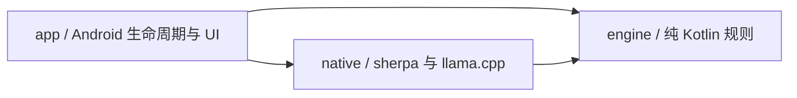
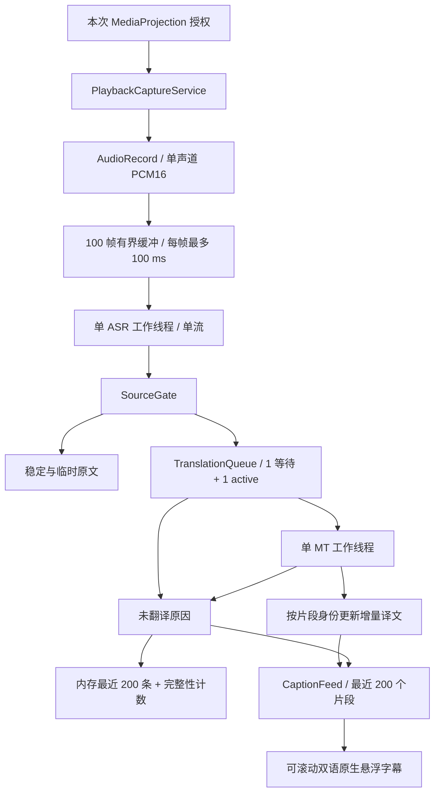

# 架构与开发边界

产品功能与使用流程见 [README](../README.md)，本文维护实现约束与开发环境；实测结果集中在[验收记录](validation.md)。

## 产品约束

服务于外语课程、技术分享与长视频观看，优先保证可读性、内容完整性和持续性能。阅读体验是待验证的差异化假设，不声称优于竞品。

- 首页以语言、字幕和运行状态表达能力，不显示量化、后端或线程参数；设置页按用户选择提供 GPU (Vulkan)、CPU、NPU (Hexagon) 三种翻译处理器；使用系统字体并支持缩放。
- 回看只改变阅读位置，暂停停止处理，停止结束会话，三者不得共用含糊状态；暂停尚未实现。无法控制任意播放器或获取其时间轴，未来导出使用采集会话时间。
- 不以切断否定、数字或专名来换取延迟，不用摘要替代完整字幕；确认片段必须有译文或明确未译结果。
- 不申请通知读取、无障碍、账号、屏幕图像访问或媒体控制权限补足核心流程。仅用户主动下载模型时联网，模型包只含数据，运行库随 APK 提供。
- 当前不做双 ASR 复核、降噪／声源分离、OCR、RAG、模型市场、云端兜底或完整播放器。后续可评估用户主动导入媒体的可控播放模式。
- 应用 ID 当前为 `com.captionglass.app`，正式分发前确认。未实现功能不接入成功占位；语言包开放依据准确性、完整性、阅读与持续功耗的共同验收，不以模型卡或短时吞吐替代。

## 1. 三种不同的时间尺度

识别假设可以修订，翻译需要完整语义，阅读需要稳定停留。`SourceGate` 分开管理原文稳定与语义提交，`TranslationQueue` 管理串行推理，`CaptionFeed` 保留按序的双语片段。译文通过节流的增量回调更新对应片段，正常结束后才成为已完成译文。

推理积压给出明确未翻译结果；阅读不再使用有时限的队列。最近 200 个片段可滚动查看，不用摘要或自动清空来追赶播放。

## 2. 三个模块



| 模块 | M1 实现 |
| --- | --- |
| `app` | Compose 三页、权限与前台服务、会话 owner、PCM 缓冲、原生 View 悬浮窗、模型下载与 SAF 导入 |
| `engine` | 原文稳定/提交/修订、单工作器队列、有界双语记录、确定性回归检查 |
| `native` | 固定版本 sherpa CPU Kotlin/JNI、llama.cpp CPU/Vulkan/Hexagon C++ 翻译绑定、句柄与取消 token；依赖纯 JVM engine 的语言枚举 |

`engine` 不依赖 Android、JNI、网络和推理库。测试注入时间，无需睡眠或模型。应用没有本地 HTTP 服务、Python 运行时、DI 或多后端注册框架。

## 3. 数据流与所有权



### 3.1 生命周期与取消

用户开启后重新取得系统授权；服务立即进入 `mediaProjection` 前台状态，再消费这一次 consent。语言包校验和加载在后台线程完成，然后开始 AudioRecord。`START_NOT_STICKY` 禁止系统恢复旧授权。不开 VirtualDisplay、Surface 或图像读取器。Android 14+ 以 `MediaProjectionConfig.createConfigForDefaultDisplay()` 请求授权，系统界面只提供共享整个屏幕。[Android 播放捕获](https://developer.android.com/media/platform/av-capture)、[MediaProjection](https://developer.android.com/media/grow/media-projection)

`CaptionSession` 的可变状态全部由 Main owner 修改。PCM 通过有界 Channel 进入；ASR 与 MT 各自只有一个专用线程。native 构造、调用、析构均在其所属线程上执行。UI 不持有 native 句柄。

停止顺序：关闭输入、停止 AudioRecord 以解除阻塞、给所有未完成确认片段发出 `STOPPED`、置 native 原子取消标记、停止接受迟到译文增量并保留已显示条目、处理已接受的 ASR 尾部、等待工作器返回、释放模型/线程/悬浮窗/projection、结束前台服务。回收完成前仍保持 busy，禁止开始第二个会话。系统撤销授权使用同一路径。读协程负责唯一一次 AudioRecord release。服务与会话以 `CaptureStatus` 发布准备、等待声音、聆听、未收到声音与各停止原因；界面将其映射为符号与短标签，不解析异常文本。

Kotlin Job 取消不等于 JNI 取消。MT token 在派发前创建，含原子取消标志与 steady-clock deadline。CPU abort callback 仅覆盖 CPU 算子；各翻译后端预填充每批最多 8 tokens，每批／生成 token 前后检查取消，并等待已提交设备工作同步后返回。小批次使用上游 Vulkan 的向量计算路径，降低手机短提示的预填充开销。GPU/NPU 在途工作不可抢占，这限制了每次等待的工作量，不保证挂起驱动下的硬实时截止时间。调用返回并卸下 callback 后才释放 token。清理失败使该 context 不再接受翻译；固定运行库的仓库补丁防止析构中的 Vulkan 同步异常穿过 noexcept 析构函数。超时/撤回后，队列保留 active 槽直到匹配的 completion 到达，因此不会启动孤儿翻译或并行访问 context。ASR 库没有中途终止构造/解码 API，停止需要等待正在执行的调用返回。

### 3.2 音频与时间

优先请求 16 kHz、单声道、PCM16；失败后请求 48 kHz。每次读取最多 100 ms，缓冲最多 100 帧，即至多 10 秒。缓冲满时显式结束会话并说明识别跟不上，绝不 `DROP_OLDEST`。流式 ASR 不通过 VAD 剔除低音量片段；新增分段 ASR 用 Silero VAD 判断停顿，但不剔除任何非零音频。幅度阈值只用于“未收到声音”的提示，不推断 DRM。

sherpa 内部有状态 `LinearResample` 将 48 kHz 输入转换到 16 kHz 特征率。会话内不切换输入率。真实采集按读取帧数计算样本时间；队列等待用 `SystemClock.elapsedRealtime()`。测试回放按样本数与同一单调时钟以 1× 速度供给。片段 `endMs` 是语义确认时已处理的样本位置，并非人工标注的发音结束位置，更不是源视频时间轴。当前不做硬件时钟漂移校准，长时漂移验收属于 M2。

流式 ASR 在实际 EOF/停止时才追加 960 ms 零样本并 `inputFinished()`，用于冲刷模型尾部；正常采集不注入静音。声学 endpoint 后提取最终残段，再使用对应 sherpa 实现的 stream reset：Zipformer 保留其声学上下文，NeMo 会重建编码器／解码器缓存，流的语言选项保留。下游语义提交从不 reset ASR。显式覆盖上游默认 20 秒时长端点，只有停顿触发 reset；长流式假设通过带绝对字符偏移的近期文本窗口交给语义层。

### 3.3 身份、语义与修订

每个会话有 UUID，`SegmentKey(sessionId, sequence, revision)` 完整匹配才接受结果。sequence 始终递增；修正后的整体重译使用新 sequence 和 revision=1，不复用旧任务身份。

每个 utterance 一个 SourceGate，绑定会话源语言，只接受更高的新音频 revision。两次假设的共同前缀为稳定原文；英文半词不会被当成稳定前缀。标点分句保守处理常见缩写、小数和姓名首字母；最长等待 5.5 秒，对明显未闭合的英文尾部额外等待最多 1.5 秒。日语例外：仅在稳定句末标点或声学 endpoint 提交，避免计时器截走句末谓语和否定；无停顿长句的等待更长，需独立校准。声学 endpoint 确认最终残段。规则是可测试的启发式，不能保证语义总是正确。

只补上的句号等纯标点尾部不构成新的翻译任务；它仍被 gate 消费，避免重复提交。native 接口也拒绝没有文字或数字的片段，防止把历史上下文误当成待翻译内容。

当已提交前缀被 ASR 推翻时，立即撤回仍在可修订窗口内的显示/待译内容，取消其 active MT，将历史标记为 `SUPERSEDED`，清除失效上下文。修正后的完整句在后续新音频假设中稳定后即可提交，不必一直等声学 endpoint。已提交且完整退出识别窗口的片段从 gate 状态及可撤回键集合中移出；不在片段中部退役，撤回后尚未重新提交的修正文也不得退役，保留未闭合的语义尾部；累计会话字符数不作为停机条件。单个翻译片段仍受 8,192 字符的数据边界约束。

### 3.4 队列、上下文与完整性

MT 默认 1 个等待槽和 1 个 active，确认后总预算仍为 8 秒，包含排队与推理。等待槽满时，新片段替换尚未开始的旧片段，旧片段得到明确的 `BACKLOG`，不取消正在执行的翻译来追赶新输入。这样避免持续过载时始终派发剩余预算不足的旧任务，但不能保证超过设备持续能力的输入全部翻译。请求记录提交时的会话单调时间；队列过期、完成验收与 native deadline 使用同一起点，音频样本结束时间只用于字幕记录。可选背景仅保留最近一个完整已确认原文片段，最多 512 字符；native 分词后超过 64 tokens 就整段省略，绝不截取背景的半句。当前待译原文保持完整，总输入加输出不超过 2,048 tokens。整段译文最多 256 输出 tokens，未遇 EOG 就用尽预算属于失败，不显示截断译文。

同一个 MT 协程在完成后直接处理下一条未过期任务。JNI 在原有 MT worker 上每约 120 ms 回调累计 UTF-8；不完整字符和 Murasaki 思考标签不发布。Main owner 按完整 SegmentKey、active call 与终态检查更新预览；取消、超时、修订后的迟到增量被忽略。失败后的已有预览保留但标为未完成，不能当作成功译文。译文完成时原位更新对应行。模型准备阶段预计算 APK 固定提示前缀，使用加载预算而不占第一句的 8 秒预算；准备时间相应增加。成功、正常取消或超时后只保留已经准备好的固定前缀 KV，移除背景、当前原文及输出对应的序列位置；下次只复用 token 完全一致的前缀，至少重新解码一个输入 token 以获取正确 logits。其他推理异常清空全部缓存；清理失败使 context 不再可用。模型释放时一并释放，没有跨会话缓存。

推理上下文清理失败通过 `TranslationUnavailableException` 传给会话 owner；当前任务先结算终态，再以“翻译中断”停止会话、停止 AudioRecord 并等待 worker 释放。不会继续向不可用的 context 派发请求。首页未翻译计数包含积压、超时和失败。`CaptionGlassMT`／`CaptionGlassNative` 日志只记录会话和片段身份、排队、首个可见预览、首 token、预填充、总耗时、token 数及失败类型，不记录语音文字。播放捕获每 10 秒抽样系统热状态和 headroom；API 不支持时保留 NaN，不据此猜测温度或自动切换模型。

终态为译文或 `BACKLOG / FAILED / TIMED_OUT / STOPPED / SUPERSEDED`。溢出、超时、停止返回值均被消费，确认计数与终态计数可核对。所有状态在提交时建立的原位置更新，不因完成顺序改变片段顺序。内存记录按 sequence 排序，只保留最近 200 条；计数覆盖整个会话。持久记录属于 M2。

### 3.5 阅读与悬浮窗

`CaptionFeed` 在原文提交时创建稳定身份的行，增量译文和最终结果更新同一行；没有阅读倒计时、两行分页或阅读溢出。`CaptionTranscriptView` 是首页与悬浮框共用的原生 ScrollView，以现有 View 原位更新文本。每组译文在上、原文在下；进行中的对应片段使用浅绿灰，完成后译文为白色、原文为次级灰。颜色表示片段状态，不伪造逐字翻译对齐。

显示方式可选滚动、两段、一段，首页与悬浮框共用同一选择，记录页始终保留全部行。滚动保留全部行并允许回看；两段／一段由 engine 的 `readingWindow` 选择阅读前沿：翻译按行序执行，首个未完成行出现译文之前保留上一条已完成行，较晚到达的积压或失败结果不会越过前沿；正在识别的原文始终显示，紧凑方式只保留其最后两行。紧凑方式不接收滚动手势。每次变化按各行原先的屏幕位置过渡：新行自下滚入，移出行淡出，增量译文就地显影，已稳定原文由临时色渐变，尚未开始翻译的行显示按原文宽度估算的占位条。所有文本动效只改渲染属性，不逐帧排版；系统动画倍率为 0 时直接到位。

手动回滚时记录可见行及行内偏移；后续增量或新片段保持该阅读位置，回到底部恢复跟随。字体变化重新布局，文本不丢失。当前保留最近 200 个片段；停止不清空应用内已显示内容，新会话建立新的记录。

悬浮层仍只有两个 Window：正文与 48 dp 把手。正文默认不透明且可滚动；把手拖动移动，轻点切换穿透并保存选择。穿透时使用 `FLAG_NOT_TOUCHABLE`，窗口 alpha 不超过 Android 的安全上限；该值作用于整窗含文字，因此次要文字提亮而非调暗。穿透卡片无法接收滚动手势，切到穿透时回到最新内容；拦截且回看时卡片底部出现“回到最新”。只有把手处理拖动，不抢走正文滚动。

正文自绘黑曜底板（纵向渐变与上亮下暗的发丝边，不使用跨窗口模糊，避免与 Vulkan 翻译争用 GPU），在状态条与字幕卡之间、以及不同内容高度之间形变。窗口只在变化开始时变高、结束时变矮，不逐帧改尺寸。卡片中心位于屏幕下半时以底边为锚向上生长（Android 11+ 使用 BOTTOM gravity 与 `fitInsetsTypes = 0`，偏移始终从显示边缘计算），否则以顶边为锚；把手跟随底板上沿。无内容时是紧凑状态条：准备中为环绕边光，等待声音为呼吸边光，聆听中显示捕获音量电平（服务每 100 ms 计算 RMS，只在内存中直接交给悬浮层，不进入状态流或记录），未收到声音与错误使用琥珀边。有内容后不因静音或定时器折叠。外观可选黑曜底板或描边（无底板、文字阴影）；状态条始终保留底板。横竖屏分别保存锚定边与位置，依据 WindowMetrics、系统栏与刘海约束；仅使用 SYSTEM_ALERT_WINDOW。[Android 触摸遮挡规则](https://developer.android.com/reference/android/view/WindowManager.LayoutParams#FLAG_NOT_TOUCHABLE)

## 4. 固定模型与运行库

`models/catalog.json` 是 APK 自带的模型目录，固定用途、语言能力、文件角色、matched files、revision、大小、SHA-256 与 runtime commit。中英 X-ASR、Nemotron 3.5、八语种 PengChengStarling 与共用的 Hy-MT2 分别安装，运行时依旧只加载一个 ASR 和一个 MT。初始中英链路通过指定真机的合成语音基础验证；新语种的验证记录见验收文档，不能外推跨机型质量或长时性能。

| 部分 | 固定配置 |
| --- | --- |
| ASR | X-ASR zh/en 480 ms；sherpa-onnx v1.13.8 / `11afbd0…`；ORT 1.28.2；CPU 单线程、greedy search |
| ASR（日语及多语新选项） | Nemotron 3.5 ASR Streaming 0.6B，560 ms；官方 sherpa INT8 encoder/decoder/joiner + tokens，revision `ab43d895…`；同一 sherpa/ORT CPU 单线程、greedy search；每条流明确设置源语言 |
| ASR（八语种备选） | PengChengStarling 八语种 streaming Zipformer；sherpa 官方 int8 encoder/joiner + matched decoder/tokens，revision `c6726c1…`；沿用同一 sherpa/ORT CPU 单线程；modified beam search，4 条 active paths |
| MT | Hy-MT2 1.8B Q4_K_M（默认）或官方 Q8_0；llama.cpp v0.4.0 / `5266f24…` + 仓库 Vulkan/Hexagon 补丁；GPU/NPU 显式选择设备并卸载层／KV；CPU 的设备列表为空、层卸载为 0、KV/算子卸载关闭；CPU 算子 3 线程；context 2,048、每次提交 / batch / ubatch 8 |
| Android native | NDK 27.1.12297006、CMake 3.22.1、arm64-v8a / ARMv8-A 基线；16 KB LOAD 对齐 |

sherpa 源码 tar 的哈希固定在 `scripts/prepare-native.sh`，`prepare-sherpa.sh` 使用上游已固定 SHA-256 的 ORT 1.28.2 和依赖构建 JNI。同版本 Kotlin JNI 声明直接复制。Qwen 完整性补丁通过现有 stream option 报告 EOS；token 上限、上下文耗尽、重复坍塌和其他早退均不能成为成功原文。llama.cpp CPU/Vulkan/Hexagon 主机代码由同一 Android NDK 静态链接到应用 JNI 库；不集成 QNN，不下载动态后端。仅在明确选中时注册并初始化相应加速器，CPU 不初始化 Vulkan。Hexagon 的四份 DSP 库来自固定源码与工具链，随 APK assets 打包，在 MT worker 上复制至私有 no-backup 目录供 FastRPC 加载；不将 Hexagon ELF 当作 ARM64 JNI 库。Vulkan-Headers 固定 `vulkan-sdk-1.4.321.0`；shaderc v2025.3、glslang、SPIRV-Tools、共用的 SPIRV-Headers 使用 matched DEPS 和归档哈希。新版宿主 glslc 在构建时生成内嵌 shader，支持 NDK 旧版编译器缺少的协作矩阵指令；宿主工具链与 Android 目标工具链分开。Vulkan 运行库来自 Android 系统。GPU 显式选择 Vulkan 设备，NPU 显式选择 HTP 设备。驱动查询必须返回已编译的 v73/v75/v79/v81，拒绝上游对未知架构的默认猜测；设置中的支持检测不打开 DSP 会话，启动时仍需成功打开真实会话。NPU 加载前按 GGUF 实际张量类型拒绝不支持的 K-quants/IQ4_XS，不靠文件名猜测。设备不可用、模型量化不兼容分别显示可恢复提示；算子／分配失败沿加载失败或未翻译路径反馈，均不静默改用另一处理器。停止后在模型与上下文释放完毕时重置 Hexagon 设备会话，下一次重新打开。Hexagon 队列每秒等待一次，连续 5 秒无响应、读取／写入错误或 DSP 运算失败会先通过 FastRPC 终止本应用的远端 DSP 进程，再抛出异常并使上下文不可用，避免错误结果成为成功译文。若驱动无法安全终止远端进程，保留 fail-stop 保护，不释放可能仍被硬件引用的内存；此时应用进程会结束。驱动调用本身不提供硬实时保证。native 日志记录选中设备和实际卸载层数，开发验收另行输出预填充、生成和清理耗时，不能仅凭设备有 GPU 就宣称加速成功。

`TranslationFormat` 按固定型号生成提示：Hy-MT2 保留原提示顺序与采样，背景仍位于翻译指令之前，仅复用两个固定角色 tokens。StreamRevise 使用作者的首段／原文历史格式与 greedy；MiLMMT 使用源、目标全名的裸 completion，不加 BOS 或聊天模板；Murasaki 使用已检查 GGUF 的 Qwen3 ChatML、简短的“仅输出完整译文”提示、已闭合思考块和 `译文：` 答案起始。Murasaki 的 greedy sampler 用现有 logit bias 屏蔽两个思考控制 token，避免在译文后继续分析；仍须正常 EOG 才成功，不因标点、换行或输出上限提前截断。角色控制符与可信系统提示单独分词，语音与历史始终 `parse_special=false`。空译文、未正常结束和未闭合思考均进入明确失败终态。JNI 用 UTF-8 byte arrays，不用 modified UTF-8 传中文。各来源、精确型号及验收范围见 [模型支持表](model-support.md)。

选型依据：PengChengStarling 提供真正的八语种流式 Transducer，sherpa 项目已有对应的 matched int8 文件与导出脚本，可复用 OnlineRecognizer 及现有音频缓冲、端点、停止逻辑。PengChengStarling 采用固定运行库的通用解码接口；对该模型，源语言选择用于能力匹配和分句，并不强制声学语言识别。上游定制服务另有 langtag 初始化接口，固定 sherpa Zipformer Kotlin 接口未提供该能力。本次不手改预编译 JNI 或偷偷变更权重。合成日语对照中 beam 比 greedy 保留更多内容，但仍有错误和漏词，详见验收记录。[上游模型卡](https://huggingface.co/stdo/PengChengStarling)、[sherpa 转换文件](https://huggingface.co/csukuangfj/sherpa-onnx-streaming-zipformer-ar_en_id_ja_ru_th_vi_zh-2025-02-10)、[上游部署与 langtag 说明](https://github.com/PCL-Voice/PengChengStarling)

Nemotron 使用同一 OnlineRecognizer，由固定运行库按已验证文件识别 NeMo 结构并设置 128 维特征。模型 metadata 实测 `window_size=65`、`chunk_shift=56`、`chunk_size_ms=560`；语言通过现有 Kotlin `OnlineStream.setOption("language", source.code)` 进入上游 prompt 映射，不手写语言 token。仅开放模型可直接转写且 Hy-MT2 也支持的 18 种输入；泰语等 adaptation-ready 项不列为 Nemotron 能力。与 PengChengStarling 合并后共 20 种输入。下载大小 682,215,356 字节；许可为 OpenMDW-1.1。固定文件与 CPU/Vulkan 真机检查见验收记录，分块时长不是端到端延迟承诺。[官方模型](https://huggingface.co/nvidia/nemotron-3.5-asr-streaming-0.6b)、[sherpa 导出](https://k2-fsa.github.io/sherpa/onnx/nemo/nemotron-streaming.html)。

Hy-MT2 的官方支持表列出 38 个语言／文字变体代码，本次按完整表建立目标枚举，并使用英文全名生成其单用户模板。它们是声明能力，只有验收文档列出的方向执行了本应用真实推理检查；所有目标并非都能作为语音输入。[Hy-MT2 模型卡与提示词](https://huggingface.co/tencent/Hy-MT2-1.8B)

### 4.1 选择与模型管理

`Language` 固定模型联合语言表；能力仍由每个型号自己的源／目标集合约束。`ModelSelection` 保存语言方向、ASR ID、MT ID 和翻译后端稳定 ID（vulkan/cpu/hexagon）。同语方向、未知代码、不兼容组合被拒绝。更改语言时保留兼容的既有选择，否则匹配第一个兼容型号；语言选择器只提供有完整识别／翻译组合的方向。SharedPreferences 保存五项偏好；权限、SAF 回调绑定发起时的模型 ID，选择在会话和安装操作期间锁定。

服务再次验证 Intent 中的语言、模型、后端代码和模型能力，创建不可变会话快照。通知与界面显示该快照，ASR 从清单文件角色得到路径，MT 使用固定目标语言全名生成提示词；句柄和 worker 所有权不变。

模型管理位于设置页，按 ASR／MT 分类，每系列一行，当前选择的系列优先。进入后各型号独立下载、导入、校验、选择和删除；容量和流式／分段能力直接显示，语言列表、来源、许可和文件名收进详情。更多菜单支持原地重新下载损坏模型，下载进度跨层级可见。仅稳定的模型身份、适配器、运行库和文件信息参与安装指纹，显示名称不会使安装失效。

ModelPack 在 Main 入口同步占用唯一操作槽，以进程级协程执行 IO，Activity 重建不会丢失进行中的状态。字幕服务也检查该槽；服务 active 保持到 native 完全释放。网络只用 GET 获取 APK 清单中的 HTTPS 固定文件，允许最多六次请求链且拒绝明文降级，不添加 HTTP 服务、账号或云端识别。网络连接／读取超时均为 15 秒；取消保持 busy，直至 IO 返回并清理完临时文件。该简单下载器没有跨进程续传，界面明确提示保持应用开启。

下载与 SAF 导入共用安装路径：StorageManager 检查和分配所需空间，文件复制到私有 `files/models/<id>-staging`，逐文件限制长度、同步写盘，全部尺寸和 SHA-256 通过后写入清单校验标记，再以同目录 rename 激活。替换期间保留旧目录；失败／取消清理 staging，进程中断通过 backup 恢复。启动时恢复安装并清理已知模型的遗留 staging／backup／deleting。每项模型的文件独立，ASR 可含各自固定的 VAD 数据，MT 每个型号各一份。每次会话前仍重新哈希所需模型；用户重新校验一开始就撤销旧标记，失败或取消不会继续显示可用。

删除先将目标 rename 为 deleting，再递归清理，避免中断后把半删目录认作安装；不会自动更换识别模型。删掉当前必需模型后首页要求重新准备，其他模型与字幕记录保留。应用申请 INTERNET 仅用于用户主动获取模型，语音和字幕不上传、不保存原始音频、不动态下载代码。运行库仍由 APK 提供。跨进程断点续传和后台任务恢复留待实际需要；native/model 许可见 `third_party/`。

### 4.2 分段 ASR

Qwen3-ASR 和 Parakeet 复用固定 sherpa OfflineRecognizer；Japanese Zipformer Base 是 raw-waveform CTC，使用随 APK 打包的 LiteRT 2.2.0 Interpreter CPU 单线程。不是旧版 ReazonSpeech transducer 的别名。Qwen 使用英文语言全名，tokenizer 文件从模型目录读取；Parakeet TDT、日语 CTC 各使用正确配置。

一个 ASR worker 同步执行 VAD 与识别。512 样本一帧，Silero 概率仅用于寻找约 1.2 秒停顿，不丢弃非零音频；精确全零窗口无需推理。首个约 4 秒窗口提供可修订原文，最长约 8 秒后保留 2 秒重叠音频继续处理。窗口时限不代表句子结束；只有停顿或实际 EOF 标为 final。48 kHz 使用同一固定 sherpa LinearResample 的有状态 JNI 包装，停止冲刷余量。没有新增音频时使用最后一次结果确认尾部，不再单独识别或重复提交重叠区。Japanese Zipformer 保留导出约定的两侧各 0.5 秒 padding、四级 attention mask 与 blank=0 CTC 解码。

`WindowTranscript` 只保留一个识别窗口，以新窗口开头的连续词／字锚点约束旧窗口后缀对齐，允许旧窗口右缘被后文修订。字符偏移区分已退出声学窗口的前缀与当前可修订区；`SourceGate` 仍负责两次新音频假设的一致性及语义提交。Parakeet 的真实 token 时间戳约束候选接缝；无法找到词锚点时按真实发射时间确定旧文边界。Qwen 的固定导出没有 token 时间戳，仅在相近置信度的重复锚点之间用已知重叠时长比例消歧，不把它当作词时间戳。没有时间戳且对齐失败时保留旧文；重复短语及识别差异仍可能造成重复，不能宣称完全无损的文本拼接。此处借鉴 [Whisper-Streaming 的局部一致性思路](https://github.com/ufal/whisper_streaming)，未引入其运行库或额外模型。

分段预览、接缝识别、VAD 错判与 CPU 推理积压仍需分别评价，不宣称等同真正流式 ASR。真正的采集失败、内存分配失败和处理速度长期不足沿既有故障路径处理；不丢帧、不切云端，不用提示文案替代正常接续。

## 5. 后续工作

当前为 M1 单路字幕闭环与多模型实验扩展；M0 骨架已完成。M2 的持久记录、导出与持续性能，以及 M3 的经验证语言／设备扩展，统一在[验收计划](validation.md#3-m2可持续体验)维护。已知错词、漏句与延迟差距必须保留，不能把短样本吞吐当作持续体验达标。

## 6. 构建与开发

### 环境

使用 JDK 17、Android SDK 36、Build Tools 35.0.0、NDK 27.1.12297006、CMake 3.22.1，以及宿主 Clang（macOS Command Line Tools／Linux clang）、Python 3 和可运行 Linux/amd64 容器的 Docker。固定版本见 `gradle/libs.versions.toml` 与 Gradle wrapper；当前仅打包 arm64-v8a，最低 API 29，compile/target API 36。

先设置 `JAVA_HOME` 和 `ANDROID_HOME`。macOS 的 Homebrew JDK 与默认 SDK 路径可用：

```sh
export JAVA_HOME="$(brew --prefix openjdk@17)"
export ANDROID_HOME="$HOME/Library/Android/sdk"
export PATH="$JAVA_HOME/bin:$ANDROID_HOME/platform-tools:$ANDROID_HOME/cmdline-tools/latest/bin:$PATH"
```

也可用不入库的 `local.properties` 配置 SDK。以下命令均从仓库根目录执行：

```sh
sdkmanager 'platforms;android-36' 'build-tools;35.0.0' 'ndk;27.1.12297006' 'cmake;3.22.1'
bash scripts/prepare-native.sh
./gradlew :engine:check :app:assembleDebug :app:lintDebug
adb -s <测试设备序列号> install -r app/build/outputs/apk/debug/app-debug.apk
```

Hexagon 准备使用上游 Snapdragon 工具链镜像 v0.7 的固定 digest `sha256:91714433626f0d94a926538a1e46ec43756c5b8e3262b91b95df1e812940aed1`（Hexagon SDK 6.6.0.0 / Tools 19.0.07）。`scripts/prepare-hexagon.sh` 在禁网容器中编译四种 DSP 内核并生成 FastRPC 接口；主机 C/C++ 仍由项目 NDK 27 编译，避免混用镜像中的 NDK 29 libc++。首次构建需下载镜像，后续输入未变时复用本地工件。

首次准备会下载哈希固定的 native 源码、ONNX Runtime 和 Khronos 头文件，编译宿主 shaderc 及匹配依赖，并应用仓库补丁。NDK 自带旧 glslc 不支持所需协作矩阵 shader；宿主工具与 Android 目标工具链分开。sherpa JNI 从固定源码构建，LiteRT 由 Gradle 随 APK 打包。

### 开发检查与资源

模型下载与导入见[模型支持](model-support.md#下载导入与选用)，测试 APK、夹具和真机命令见[验收文档](validation.md#1-m1-可重复检查)。构建与核心检查无需推理权重。

`models/catalog.json` 维护唯一模型清单，`scripts/` 维护依赖准备与设备检查，`third_party/` 维护许可。不要提交 SDK 路径、密钥、权重、音频、APK 或本地 `statusquo.md`。提交前运行上面的三项 Gradle 检查。

品牌图标由内置 imagegen 生成，透明 PNG 同时用于 README、首页与自适应桌面图标；桌面前景留出裁切余量，主题图标使用简化矢量轮廓。原始生成提示见[图标提示词](assets/icon-prompt.txt)。
