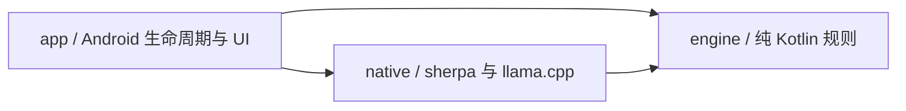
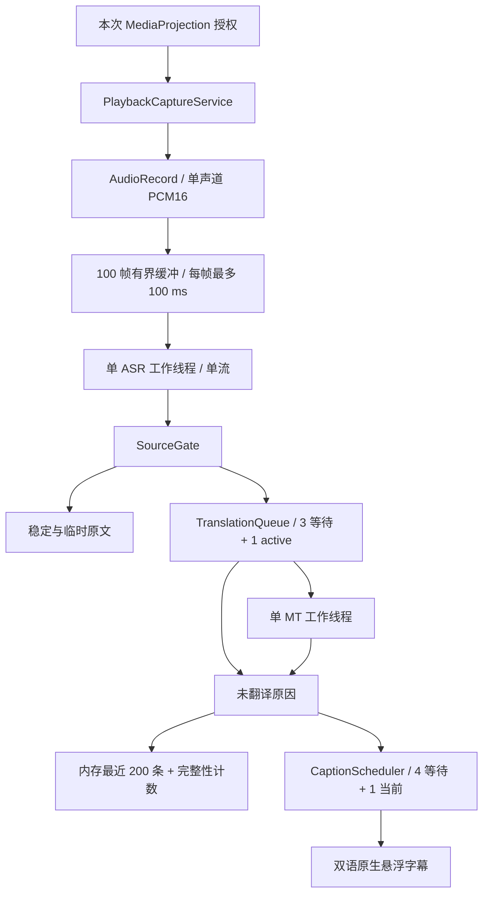

# 架构与开发边界

## 1. 三种不同的时间尺度

识别假设可以修订，翻译需要完整语义，阅读需要稳定停留。`SourceGate` 分开管理原文稳定与语义提交，`TranslationQueue` 管理串行推理，`CaptionScheduler` 管理阅读。翻译 token 不直接驱动字幕。

推理积压与阅读积压分别计数。前者给出明确未翻译结果；后者保留完整记录并提示回看，不摘要、不删除已确认文本。

## 2. 三个模块

| 模块 | M1 实现 |
| --- | --- |
| `app` | Compose 三页、权限与前台服务、会话 owner、PCM 缓冲、原生 View 悬浮窗、离线语言包导入 |
| `engine` | 原文稳定/提交/修订、单工作器队列、分页阅读调度、确定性回归检查 |
| `native` | 固定版本 sherpa CPU Kotlin/JNI、llama.cpp Vulkan C++ 翻译绑定、句柄与取消 token；依赖纯 JVM engine 的语言枚举 |

`engine` 不依赖 Android、JNI、网络和推理库。测试注入时间，无需睡眠或模型。应用没有本地 HTTP 服务、Python 运行时、DI 或多后端注册框架。M0 固定文本预览已移除。

## 3. 数据流与所有权

### 3.1 生命周期与取消

用户开启后重新取得系统授权；服务立即进入 `mediaProjection` 前台状态，再消费这一次 consent。语言包校验和加载在后台线程完成，然后开始 AudioRecord。`START_NOT_STICKY` 禁止系统恢复旧授权。不开 VirtualDisplay、Surface 或图像读取器。Android 14+ 以 `MediaProjectionConfig.createConfigForDefaultDisplay()` 请求授权，系统界面只提供共享整个屏幕。[Android 播放捕获](https://developer.android.com/media/platform/av-capture)、[MediaProjection](https://developer.android.com/media/grow/media-projection)

`CaptionSession` 的可变状态全部由 Main owner 修改。PCM 通过有界 Channel 进入；ASR 与 MT 各自只有一个专用线程。native 构造、调用、析构均在其所属线程上执行。UI 不持有 native 句柄。

停止顺序：关闭输入、停止 AudioRecord 以解除阻塞、给所有未完成确认片段发出 `STOPPED`、置 native 原子取消标记、停止发布阅读页、处理已接受的 ASR 尾部、等待工作器返回、释放模型/线程/悬浮窗/projection、结束前台服务。回收完成前仍保持 busy，禁止开始第二个会话。系统撤销授权使用同一路径。读协程负责唯一一次 AudioRecord release。服务与会话以 `CaptureStatus` 发布准备、等待声音、聆听、未收到声音与各停止原因；界面将其映射为符号与短标签，不解析异常文本。

Kotlin Job 取消不等于 JNI 取消。MT token 在派发前创建，含原子取消标志与 steady-clock deadline。CPU abort callback 仅覆盖 CPU 算子；Vulkan 预填充每批最多 8 tokens，每批／生成 token 前后检查取消，并等待已提交 GPU 工作同步后返回。小批次使用上游 Vulkan 的向量计算路径，降低手机短提示的预填充开销。GPU 在途工作不可抢占，这限制了每次等待的工作量，不保证挂起驱动下的硬实时截止时间。调用返回并卸下 callback 后才释放 token。清理失败使该 context 不再接受翻译；固定运行库的仓库补丁防止析构中的 Vulkan 同步异常穿过 noexcept 析构函数。超时/撤回后，队列保留 active 槽直到匹配的 completion 到达，因此不会启动孤儿翻译或并行访问 context。ASR 库没有中途终止构造/解码 API，停止需要等待正在执行的调用返回。

### 3.2 音频与时间

优先请求 16 kHz、单声道、PCM16；失败后请求 48 kHz。每次读取最多 100 ms，缓冲最多 100 帧，即至多 10 秒。缓冲满时显式结束会话并说明识别跟不上，绝不 `DROP_OLDEST`。流式 ASR 不通过 VAD 剔除低音量片段；新增分段 ASR 用 Silero VAD 判断停顿，但不剔除任何非零音频。幅度阈值只用于“未收到声音”的提示，不推断 DRM。

sherpa 内部有状态 `LinearResample` 将 48 kHz 输入转换到 16 kHz 特征率。会话内不切换输入率。真实采集按读取帧数计算样本时间；队列等待用 `SystemClock.elapsedRealtime()`。测试回放按样本数与同一单调时钟以 1× 速度供给。片段 `endMs` 是语义确认时已处理的样本位置，并非人工标注的发音结束位置，更不是源视频时间轴。当前不做硬件时钟漂移校准，长时漂移验收属于 M2。

流式 ASR 在实际 EOF/停止时才追加 960 ms 零样本并 `inputFinished()`，用于冲刷模型尾部；正常采集不注入静音。声学 endpoint 后提取最终残段，再使用对应 sherpa 实现的 stream reset：Zipformer 保留其声学上下文，NeMo 会重建编码器／解码器缓存，流的语言选项保留。下游语义提交从不 reset ASR。

### 3.3 身份、语义与修订

每个会话有 UUID，`SegmentKey(sessionId, sequence, revision)` 完整匹配才接受结果。sequence 始终递增；修正后的整体重译使用新 sequence 和 revision=1，不复用旧任务身份。

每个 utterance 一个 SourceGate，绑定会话源语言，只接受更高的新音频 revision。两次假设的共同前缀为稳定原文；英文半词不会被当成稳定前缀。标点分句保守处理常见缩写、小数和姓名首字母；最长等待 5.5 秒，对明显未闭合的英文尾部额外等待最多 1.5 秒。日语例外：仅在稳定句末标点或声学 endpoint 提交，避免计时器截走句末谓语和否定；无停顿长句的等待更长，需独立校准。声学 endpoint 确认最终残段。规则是可测试的启发式，不能保证语义总是正确。

只补上的句号等纯标点尾部不构成新的翻译任务；它仍被 gate 消费，避免重复提交。native 接口也拒绝没有文字或数字的片段，防止把历史上下文误当成待翻译内容。

当已提交前缀被 ASR 推翻时，立即撤回本 utterance 对应的显示/待译内容，取消其 active MT，将历史标记为 `SUPERSEDED`，清除失效上下文。在声学 endpoint 只提交一次完整修正，避免连续修订反复重译。原文超过 8,192 字符会明确报错停止，不能静默截断。

### 3.4 队列、上下文与完整性

MT 默认 3 个等待槽和 1 个 active，确认后最多等待 8 秒。上下文最多 4 个已确认原文片段、512 字符；native tokenizer 再限制历史最多 256 tokens，总输入加输出不超过 2,048 tokens。整段译文最多 256 输出 tokens，未遇 EOG 就用尽预算属于失败，不显示截断译文。

同一个 MT 协程在完成后直接处理下一条未过期任务，不再等待 80 ms 的显示轮询。译文完成时立即交给阅读调度；已有页面仍遵守最短停留。native 在成功或异常返回前统一清零 KV，不在下一次入口重复清零；没有跨请求缓存复用。

终态为译文或 `BACKLOG / FAILED / TIMED_OUT / STOPPED / SUPERSEDED`。溢出、超时、停止返回值均被消费，确认计数与终态计数可核对。BACKLOG 立即进记录并更新单独提示，不把较晚的拒绝片段插到较早的在途译文之前。内存记录按 sequence 排序，只保留最近 200 条；计数覆盖整个会话。持久记录属于 M2。

### 3.5 阅读与悬浮窗

Android `StaticLayout` 按实际字号测量每种语言最多两行的页面，阅读调度每页停留 1.6–6 秒。各侧阅读时间分别估算：汉字、平假名、片假名和韩文每码点 100 ms，其他码点 50 ms；取原文和译文较长的一侧，不把两侧时间相加。这是待阅读测试校准的启发式，不代表每位用户都能以此速度读完。完整文本保留在记录，长译文分多页，不用省略号代替后半句。队列满或迟到结果更新阅读积压提示；显示序号不会倒退。字体/显示配置改变后重新测量待显示内容。

悬浮层有两个原生 Window：正文卡片默认 `FLAG_NOT_TOUCHABLE`，其上方居中的 48 dp 把手支持拖动（靠近水平中心时吸附）与轻点切换。穿透时正文窗口 alpha 不超过系统允许的触摸遮挡阈值；Android 12+ 仅设背景透明度不足以允许穿透。拦截模式下卡片可触摸、不透明并以绿色描边标识，轻点卡片或把手回到穿透。尚无文字时卡片收缩为图标加短词的状态胶囊；未稳定的临时原文以较暗颜色显示，译文位置用脉动圆点占位；长字幕的分页以卡片底部细分段条表示。[WindowManager 触摸规则](https://developer.android.com/reference/android/view/WindowManager.LayoutParams#FLAG_NOT_TOUCHABLE)

横竖屏分别保存位置，依据 WindowMetrics、系统栏与刘海安全区约束范围。两方向使用保守的窄边宽度；字体缩放按系统 sp。只使用 `SYSTEM_ALERT_WINDOW`，不用无障碍绕过权限。拒绝悬浮窗时仍能在应用内部查看字幕。

## 4. 固定模型与运行库

`models/catalog.json` 是 APK 自带的模型目录，固定用途、语言能力、文件角色、matched files、revision、大小、SHA-256 与 runtime commit。中英 X-ASR、Nemotron 3.5、八语种 PengChengStarling 与共用的 Hy-MT2 分别安装，运行时依旧只加载一个 ASR 和一个 MT。初始中英链路通过指定真机的合成语音基础验证；新语种的验证记录见验收文档，不能外推跨机型质量或长时性能。

| 部分 | 固定配置 |
| --- | --- |
| ASR | X-ASR zh/en 480 ms；sherpa-onnx v1.13.8 / `11afbd0…`；ORT 1.28.2；CPU 单线程、greedy search |
| ASR（日语及多语新选项） | Nemotron 3.5 ASR Streaming 0.6B，560 ms；官方 sherpa INT8 encoder/decoder/joiner + tokens，revision `ab43d895…`；同一 sherpa/ORT CPU 单线程、greedy search；每条流明确设置源语言 |
| ASR（八语种备选） | PengChengStarling 八语种 streaming Zipformer；sherpa 官方 int8 encoder/joiner + matched decoder/tokens，revision `c6726c1…`；沿用同一 sherpa/ORT CPU 单线程；modified beam search，4 条 active paths |
| MT | Hy-MT2 1.8B Q4_K_M；llama.cpp v0.4.0 / `5266f24…` + 仓库 Vulkan 清理补丁；首个 Vulkan 设备，全部层／KV／支持的算子卸载；剩余 CPU 算子 3 线程；context 2,048、每次提交 / batch / ubatch 8 |
| Android native | NDK 27.1.12297006、CMake 3.22.1、arm64-v8a / ARMv8-A 基线；16 KB LOAD 对齐 |

sherpa 源码 tar 的哈希固定在 `scripts/prepare-native.sh`，`prepare-sherpa.sh` 使用上游已固定 SHA-256 的 ORT 1.28.2 和依赖构建 JNI。同版本 Kotlin JNI 声明直接复制。Qwen 完整性补丁通过现有 stream option 报告 EOS；token 上限、上下文耗尽、重复坍塌和其他早退均不能成为成功原文。llama.cpp CPU/Vulkan 后端静态链接到应用 JNI 库；不集成 QNN，不下载动态后端。Vulkan-Headers 固定 `vulkan-sdk-1.4.321.0`；shaderc v2025.3、glslang、SPIRV-Tools、共用的 SPIRV-Headers 使用 matched DEPS 和归档哈希。新版宿主 glslc 在构建时生成内嵌 shader，支持 NDK 旧版编译器缺少的协作矩阵指令；宿主工具链与 Android 目标工具链分开。Vulkan 运行库来自 Android 系统。显式选择 Vulkan 设备，不支持 Vulkan 1.2、算子／分配失败时沿现有加载失败或未翻译路径反馈；不静默切回纯 CPU 翻译。native 日志记录选中设备和实际卸载层数，开发验收另行输出预填充、生成和清理耗时，不能仅凭设备有 GPU 就宣称加速成功。

`TranslationFormat` 按固定型号生成提示：Hy-MT2 保留原采样；StreamRevise 使用作者的首段／原文历史格式与 greedy；MiLMMT 使用源、目标全名的裸 completion，不加 BOS 或聊天模板；Murasaki 使用已检查 GGUF 的 Qwen3 ChatML、官方 short 系统提示和关闭思考的后缀。后三者 greedy。角色控制符与可信系统提示单独分词，语音与历史始终 `parse_special=false`。空译文、未正常结束和未闭合思考均进入明确失败终态。JNI 用 UTF-8 byte arrays，不用 modified UTF-8 传中文。各来源、精确型号及验收范围见 [模型支持表](model-support.md)。

选型依据：PengChengStarling 提供真正的八语种流式 Transducer，sherpa 项目已有对应的 matched int8 文件与导出脚本，可复用 OnlineRecognizer 及现有音频缓冲、端点、停止逻辑。PengChengStarling 采用固定运行库的通用解码接口；对该模型，源语言选择用于能力匹配和分句，并不强制声学语言识别。上游定制服务另有 langtag 初始化接口，固定 sherpa Zipformer Kotlin 接口未提供该能力。本次不手改预编译 JNI 或偷偷变更权重。合成日语对照中 beam 比 greedy 保留更多内容，但仍有错误和漏词，详见验收记录。[上游模型卡](https://huggingface.co/stdo/PengChengStarling)、[sherpa 转换文件](https://huggingface.co/csukuangfj/sherpa-onnx-streaming-zipformer-ar_en_id_ja_ru_th_vi_zh-2025-02-10)、[上游部署与 langtag 说明](https://github.com/PCL-Voice/PengChengStarling)

Nemotron 使用同一 OnlineRecognizer，由固定运行库按已验证文件识别 NeMo 结构并设置 128 维特征。模型 metadata 实测 `window_size=65`、`chunk_shift=56`、`chunk_size_ms=560`；语言通过现有 Kotlin `OnlineStream.setOption("language", source.code)` 进入上游 prompt 映射，不手写语言 token。仅开放模型可直接转写且 Hy-MT2 也支持的 18 种输入；泰语等 adaptation-ready 项不列为 Nemotron 能力。与 PengChengStarling 合并后共 20 种输入。下载大小 682,215,356 字节；许可为 OpenMDW-1.1。固定文件与 CPU/Vulkan 真机检查见验收记录，分块时长不是端到端延迟承诺。[官方模型](https://huggingface.co/nvidia/nemotron-3.5-asr-streaming-0.6b)、[sherpa 导出](https://k2-fsa.github.io/sherpa/onnx/nemo/nemotron-streaming.html)。

Hy-MT2 的官方支持表列出 38 个语言／文字变体代码，本次按完整表建立目标枚举，并使用英文全名生成其单用户模板。它们是声明能力，只有验收文档列出的方向执行了本应用真实推理检查；所有目标并非都能作为语音输入。[Hy-MT2 模型卡与提示词](https://huggingface.co/tencent/Hy-MT2-1.8B)

### 4.1 选择与模型管理

`Language` 固定模型联合语言表；能力仍由每个型号自己的源／目标集合约束。`ModelSelection` 保存语言方向、ASR ID 和 MT ID。同语方向、未知代码、不兼容组合被拒绝。更改语言时保留兼容的既有选择，否则匹配第一个兼容型号；语言选择器只提供有完整识别／翻译组合的方向。SharedPreferences 保存四项偏好；权限、SAF 回调绑定发起时的模型 ID，选择在会话和安装操作期间锁定。

服务再次验证 Intent 中的代码和模型能力，创建不可变会话快照。通知与界面显示该快照，ASR 从清单文件角色得到路径，MT 使用固定目标语言全名生成提示词；句柄和 worker 所有权不变。

模型管理位于设置页，按 ASR／MT 分类，每系列一行，当前选择的系列优先。进入后各型号独立下载、导入、校验、选择和删除；容量和流式／分段能力直接显示，语言列表、来源、许可和文件名收进详情。更多菜单支持原地重新下载损坏模型，下载进度跨层级可见。仅稳定的模型身份、适配器、运行库和文件信息参与安装指纹，显示名称不会使安装失效。

ModelPack 在 Main 入口同步占用唯一操作槽，以进程级协程执行 IO，Activity 重建不会丢失进行中的状态。字幕服务也检查该槽；服务 active 保持到 native 完全释放。网络只用 GET 获取 APK 清单中的 HTTPS 固定文件，允许最多六次请求链且拒绝明文降级，不添加 HTTP 服务、账号或云端识别。网络连接／读取超时均为 15 秒；取消保持 busy，直至 IO 返回并清理完临时文件。该简单下载器没有跨进程续传，界面明确提示保持应用开启。

下载与 SAF 导入共用安装路径：StorageManager 检查和分配所需空间，文件复制到私有 `files/models/<id>-staging`，逐文件限制长度、同步写盘，全部尺寸和 SHA-256 通过后写入清单校验标记，再以同目录 rename 激活。替换期间保留旧目录；失败／取消清理 staging，进程中断通过 backup 恢复。启动时恢复安装并清理已知模型的遗留 staging／backup／deleting。每项模型的文件独立，ASR 可含各自固定的 VAD 数据，MT 每个型号各一份。每次会话前仍重新哈希所需模型；用户重新校验一开始就撤销旧标记，失败或取消不会继续显示可用。

删除先将目标 rename 为 deleting，再递归清理，避免中断后把半删目录认作安装；不会自动更换识别模型。删掉当前必需模型后首页要求重新准备，其他模型与字幕记录保留。应用申请 INTERNET 仅用于用户主动获取模型，语音和字幕不上传、不保存原始音频、不动态下载代码。运行库仍由 APK 提供。跨进程断点续传和后台任务恢复留待实际需要；native/model 许可见 `third_party/`。

### 4.2 分段 ASR

Qwen3-ASR 和 Parakeet 复用固定 sherpa OfflineRecognizer；Japanese Zipformer Base 是 raw-waveform CTC，使用随 APK 打包的 LiteRT 2.2.0 Interpreter CPU 单线程。不是旧版 ReazonSpeech transducer 的别名。Qwen 使用英文语言全名，tokenizer 文件从模型目录读取；Parakeet TDT、日语 CTC 各使用正确配置。

一个 ASR worker 同步执行 VAD 与识别。512 样本一帧，Silero 概率仅用于寻找约 1.2 秒停顿，不丢弃非零音频；精确全零帧无需推理。缓冲最多 14 秒；超过上限仍无完整停顿时明确停止并提示切换流式模型，不能将人为截断的句尾标为 final。48 kHz 通过同一固定 sherpa LinearResample 源码的薄 JNI 包装连续重采样，停止冲刷余量。结束只识别尚未提交的尾部，不重新提交已完成窗口。Japanese Zipformer 按官方导出约定追加两侧各 0.5 秒模型内部 padding、生成四级 attention mask，并按 blank=0 的 CTC 合并规则解码。

分段模型没有临时原文；长停顿依赖、短句质量、VAD 错判和 CPU 推理积压均需单独评价，不宣称等同于真正流式识别。它们沿用现有有界 PCM 通道和显式 overrun/识别失败路径，不丢帧、不切云端。

## 5. 后续工作

暂停/回看、Room 与文字保留选择、TXT/SRT/VTT、相关术语、完整安装管理、30–60 分钟热稳态、多设备画像尚未实现。已知 ASR 错词与延迟目标差距必须保留在验收记录。日语等新语种的持续性能、STQ 或加速后端均须独立验证，不能把短样本吞吐当作持续体验达标。详见 [验收计划](validation.md)。
